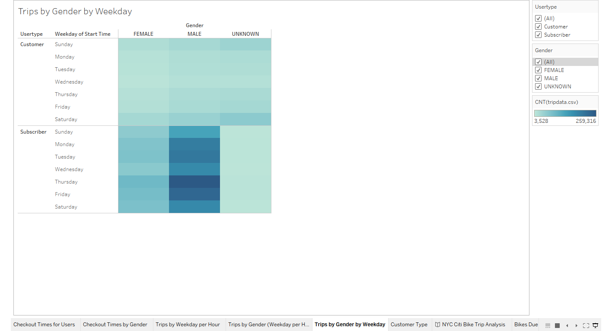
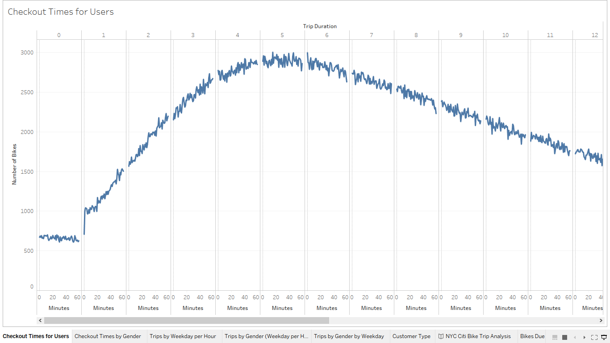
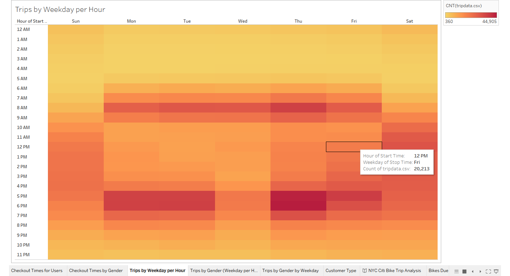
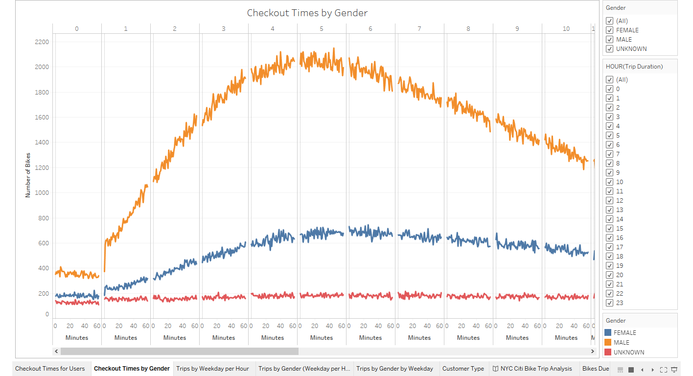
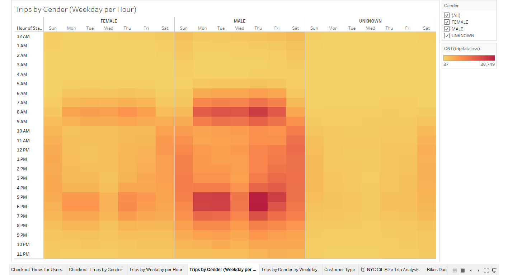
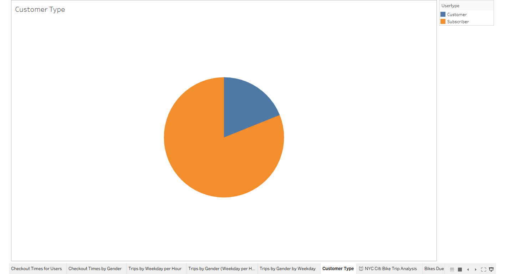
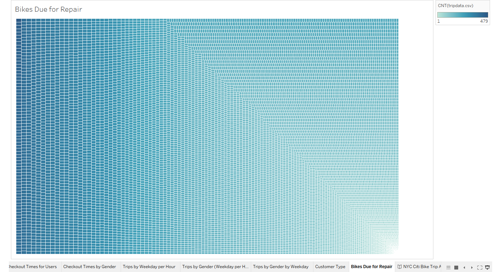

# NYC Citi Bike Analysis

NOTE: Please follow the link for the supporting [Tableau presentation](https://public.tableau.com/views/citibike_challenge_16032866959400/NYCCitiBikeTripAnalysis?:language=en&:display_count=y&publish=yes&:origin=viz_share_link)

## Overview of Analysis

The purpose of this analysis is to show the viability of a bike sharing business in Des Moines, IA by breaking down data from the New York City Citi Bike system.

## Results

There are several results worth noting after analyzing the data. These results are shared below.

* The above chart shows the number of trips broken down by day, gender, and usertype. There are three main take aways from this chart:
    1) There are a majority male riders
    2) Thursday is the most popular day
    3) There are more annual subscriber users than one-time customers
 

* This chart shows how long users are using bikes during one trip. Most trips last between 4.5 to 6 hours.

* The above heat map shows that bike usage throughout the week is predictable with usage peaking around 8:00 AM and 5:00 PM - 7:00 PM. Usage is more spread out throughout the      day over the weekends.

* This chart shows similar data as the previous two chars. A majority of trips last between 4 to 6 hours and males make up a bulk of the customers. 

* This heat map shows the same trends as have been seen in previous models. The peak times for both males and females is in the morning, around 8:00 AM, and evening, around 5:00 PM to 6:00 PM, during the week. The weekends show a more steady use of bikes throughout the day.

* The above pie chart shows that annual Citi Bike subscribers make up 81% of the customer base.

* The above chart shows the number of trips for each bike by color. This chart can help determine what bikes are ready to be inspected for routine maintenance.

## Summary

The data shows several key points. First, a majority of trips are for several hours at a time, which will help bring in more money compared to short trips. Second is that there are significantly more male users than female users and a large majority of customers subscribe to the annual membership. This helps narrow down the target market and the customer base to go after. Third, the busiest times are in the mornings and evenings during the week. During the weekends the usage is spread out throughout the day.

There are a couple new charts that can be made to help evaluate the data further. First chart idea is a breakdown comparing the total number of bikes compared to users in NYC. This chart would help establish the number of bikes to utilize in Des Moines. The second chart idea is a chart showing the age breakdown compared to number of rides to help narrow down the market of which to focus on moving forward.
